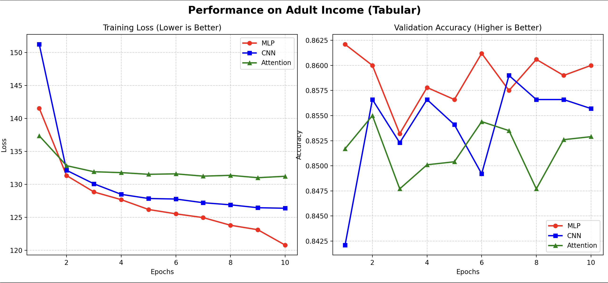
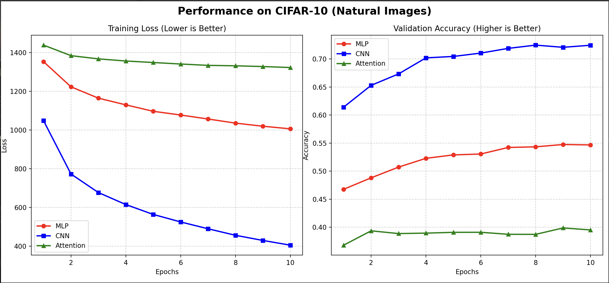

---

# **Deep Learning Assignment 1: Datasets × Architectures Benchmark**

## **1\. Objective and Learning Outcomes**

The primary objective of this assignment was to explore different deep learning architectures and how well they perform with three different datasets. Using tabular, natural images, and medical images datasets with MLP, CNN, and attention-based MLP, we aim to observe which architectures are suitable and better for specific data types.

**Key Learning Outcomes:**

* Learned to break down a big deep learning project into separate individual modules, separating model definitions, datasets, and running models into individual files.  
* Gained understanding of data-preprocessing (one-hot encoding categorical variables, normalizing tabular data, and normalizing pixel values  
* Understanding the model complexity, accuracy, and training time.

---

## **2\. Code Structure**

The code structure follows a modular design as follows:

* **config/config.yaml:** Stores parameters (epoch number, batch size, learning rate) and directory for downloaded datasets to be stored.   
* **src/dataset.py:** Responsible for downloading datasets, preprocessing data, and performing train/test split.   
* **src/models.py**: Contains definitions for the three architectures (MLP, CNN, Attention-based MLP)  
* **src/utils.py:** Contains the code for training and evaluating the models.  
* **main.py**: Loading config files, running all the models, and recording the results.

### **How to run the code**

1) Clone the Github repo.  
2) Install the required dependencies as follows:

```py
pip install torch torchvision pyyaml numpy pandas scikit-learn h5py gdown
```

3) Run the main.py

```py
python -u main.py
```

---

## **3\. Datasets and Architectures**

### **Datasets**

1. **UCI Adult Income (Tabular):** Predicting income (\>50k) based on 14 features like age, education, and marital status.   
   Input: Mixed numerical \+ categorical features. Output: Binary label  
2. **CIFAR-10 (Natural Images):** Classifying 10 types of objects (cars, birds, etc) in 32x32 RGB images.   
   Input: 32x32 RGB images. Output: Classes (0-9)  
3. **PatchCamelyon / PCam (Medical Images):** Detecting tumor tissue in histology slides. Designed for histopathology image classification.

Input: 96x96 RGB patches. Output: Binary level (0-\>normal tissue. 1-\>tumor tissue)

### **The Architectures**

1. **MLP (Multi-Layer Perceptron):** A dense network that treats all input features as independent units.  
2. **CNN (Convolutional Neural Network):** Uses filters to scan inputs, preserving spatial relationships.  
3. **Attention-based MLP:** a neural network architecture that combines the parallel processing efficiency of MLPs with the dynamic weighting capabilities of attention mechanisms.

---

## **4\. Final Results & Analysis**

### **Experimental Results Table**

| Dataset | Architecture | Accuracy | F1 Score | Time |
| :---- | :---- | :---- | :---- | :---- |
| Adult | MLP | 0.8701 | 0.8682 | 3.0s |
| Adult | CNN | 0.8658 | 0.8654 | 26.5s |
| Adult | Attention | 0.8585 | 0.8535 | 2.8s |
| CIFAR-10 | MLP | 0.5467 | 0.5428 | 37.9s |
| CIFAR-10 | CNN | 0.7241 | 0.7235 | 165.1s |
| CIFAR-10 | Attention | 0.3951 | 0.3871 | 32.8s |
| PCam | MLP | 0.7115 | 0.7020 | 1765.5s |
| PCam | CNN | 0.8226 | 0.8215 | 7074s |
| PCam | Attention | 0.7180 | 0.7180 | 1646s |

### **Training VS Validation Curves**






---

## **5\. Key Takeaways & Insights**

* On the UCI Adult Income dataset, MLP achieved the highest accuracy (87.01%) while also being extremely fast (3.0s). The CNN model performs similarly but takes relatively longer (26.5s)  because CNN models try to find patterns between neighboring columns. In tabular data, features or columns are independent (i.e. they lack a fixed spatial order) so, the CNN’s spatial search is too much effort. The attention-based MLP performed similarly to the MLP but with slightly lower accuracy since there is no sequence in a single row of data.   
* On the CIFAR-10 dataset, the CNN performs better (72.41%)  than both MLP (54.67%) and attention-based MLP (39.51%) since images have local patterns between neighboring pixels, a pixel is highly related to another pixel next to it. MLP flattens the 32x32 RGB images losing all spatial connection, while CNN preserves this using kernels. For the attention model, I believe since it flattens the image, it loses the spatial information and performs poorly, similarly to the MLP  
* On the PCAM dataset, the CNN performs better (82.26%) than both MLP (71.15%) and attention-based MLP (71.80%) since tumor textures also have local patterns. However, the CNN is computationally expensive here because we have larger image sizes (96x96 RGB textures). I feel like accuracy is more important than computational cost here because it deals with medical imaging.

### **Takeways & Learnings**

From these results, we can see that MLPs are better for tabular data, CNNs are for images, and attention mechanisms are powerful, but only if applied correctly. For the PCam dataset, I used the whole large dataset, and I believe that is why the training time took so long for all three architectures, especially CNN. Also, I forgot to add the plotting in the initial code, and I extracted the training loss and accuracy for each epoch and used a different plot.py file to plot the graphs.

